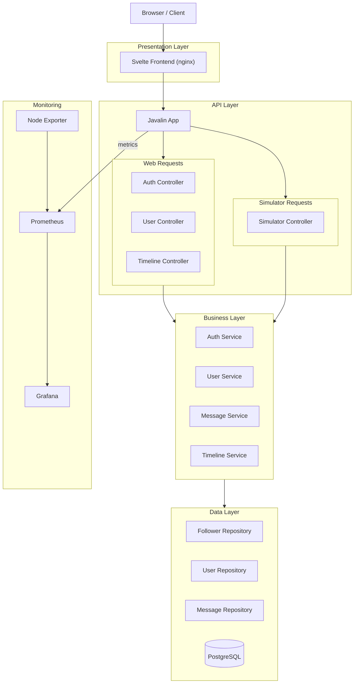

# MiniTwit

> A production microblogging application — live under continuous simulator load at **[zerodt.live](https://zerodt.live)**

[](https://zerodt.live)
[](https://github.com/ZeroDownTime-ITU/minitwit_project/releases/latest)
[](https://github.com/ZeroDownTime-ITU/minitwit_project/actions/workflows/continuous-deployment.yml)

[](https://app.codacy.com/gh/ZeroDownTime-ITU/minitwit_project/dashboard?utm_source=gh&utm_medium=referral&utm_content=&utm_campaign=Badge_grade)

---

## Overview

MiniTwit is a microblogging application built and operated as part of the MSc DevOps course at IT University of Copenhagen. It runs live at [zerodt.live](https://zerodt.live) under continuous load from a course-operated simulator that registers users, posts messages, and queries the API around the clock. The project covers the full DevOps lifecycle: automated CI/CD, containerised deployment, infrastructure-as-code, and production observability.

---

## Architecture

<details>
<summary>Architecture Diagram (click to expand)</summary>
    

</details>

Incoming traffic hits the DigitalOcean Load Balancer (168.144.4.198), which terminates TLS (Let's Encrypt cert for zerodt.live) and distributes requests across all three Swarm nodes. Each node runs the Svelte frontend (nginx) and the Java backend. The Java backend connects to PostgreSQL on a dedicated `minitwit-db` droplet over the private network. Prometheus on the `minitwit-monitoring` droplet scrapes all three Swarm node IPs on ports 7070 and 9100. Grafana Alloy runs as a container on each Swarm and db node, shipping logs to Loki on the monitoring droplet (private network, port 3100). Grafana queries both Prometheus and Loki for dashboards and log exploration.

---

## Tech Stack

| Component | Technology |
|---|---|
| Backend | Java 21, Javalin 7, jOOQ, HikariCP |
| Frontend | SvelteKit 2, Svelte 5, TypeScript, TailwindCSS 4 |
| Database | PostgreSQL 15 |
| Reverse Proxy | nginx (Alpine) — serving static frontend and proxying API |
| TLS | DO Load Balancer (168.144.4.198) — Let's Encrypt cert for zerodt.live |
| Containerisation | Docker Swarm (production, 3-manager cluster), Docker Compose (local dev) |
| CI/CD | GitHub Actions — tag, test, build, deploy (Ansible), verify |
| Observability | Prometheus, Grafana, Loki, Grafana Alloy |
| Code Quality | SonarCloud, Codacy |
| Infrastructure | OpenTofu, Ansible, DigitalOcean (5 Droplets + Block Storage) |

---

## Getting Started

### Prerequisites

- Docker ≥ 24 and Docker Compose V2
- Java 21 and Maven 3.9+ (to run tests outside Docker)
- OpenTofu and Ansible (cloud deployment only)

### Run locally with Docker Compose

```bash
git clone https://github.com/ZeroDownTime-ITU/minitwit_project.git
cd minitwit_project
docker compose -f docker-compose.local.yml up --build
```

| Service | URL |
|---|---|
| Frontend (Vite dev server) | http://localhost:5173 |
| Backend API | http://localhost:7070 |
| Prometheus | http://localhost:9090 |
| Grafana | http://localhost:3000 |

The local stack (`docker-compose.local.yml`) uses hardcoded dev credentials, hot-reload for the Svelte frontend, and exposes port `5005` for Java remote debugging (attach with any JDWP-compatible debugger).

### Run tests

```bash
cd minitwit-java
mvn test
```

The test suite uses an H2 in-memory database and covers: user registration, login/logout, message posting, timeline behaviour (public vs. user), authorisation enforcement, and 404 handling.

### Deploy to DigitalOcean

```bash
export TF_VAR_do_token=<your-do-token>

cd infra
./provision.sh   # runs tofu apply then ansible-playbook site.yml
```

`provision.sh` first runs `tofu apply` to create the five DigitalOcean droplets and associated block storage volumes, then runs `ansible-playbook site.yml` to configure Docker Swarm, deploy the app and monitoring stacks, and wire up the DO Load Balancer.

---

## CI/CD Pipeline

Two GitHub Actions workflows are relevant for deployment.

### `continuous-deployment.yml`

Triggers when changes land in `minitwit-java/` or `minitwit-svelte/`. Also supports manual dispatch.

**Job: tag** (parallel with test)
Reads the latest `v*.*.*` git tag (defaulting to `v0.0.0`) and bumps the version based on commit message keywords:

| Keyword in commit message | Version bump |
|---|---|
| `#major` | `v1.2.3` → `v2.0.0` |
| `#minor` | `v1.2.3` → `v1.3.0` |
| *(anything else)* | `v1.2.3` → `v1.2.4` |

Creates a git tag and a GitHub release with auto-generated release notes.

**Job: test** (parallel with tag)
Sets up JDK 21 (Temurin) and runs `mvn test`. The pipeline fails here if any test breaks.

**Job: build** (needs tag + test)
Builds and pushes two Docker images to Docker Hub (`despotheanimal/` org), tagged with both `:latest` and the new semver tag:
- `minitwit-java`
- `minitwit-svelte`

Uses Docker Buildx with registry-layer caching for faster subsequent builds.

**Job: deploy** (needs tag + build)
Installs Ansible, configures SSH, and runs a rolling Swarm update via:
```
ansible-playbook site.yml --tags deploy -e version=<new_tag>
```

**Job: verify** (needs deploy)
Polls `https://zerodt.live/api/latest` up to 10 times (15 s apart) and exits non-zero if the endpoint never returns HTTP 200.

### `deploy-test.yml`

Dry-run workflow triggered on pushes to `test/**` branches — runs the same Ansible deploy step with `--check` to validate playbook changes without touching production.

### `sonar.yml`

Triggers on push to `main`/`master` and on all pull requests. Runs SonarCloud static analysis (`mvn sonar:sonar`) against the `zerodowntime-itu` organisation.

---

## Observability

### Metrics

Prometheus (on `minitwit-monitoring`) scrapes six targets — two per Swarm node:

- **`<node-ip>:7070/metrics`** — JVM heap, GC pause times, thread count, HikariCP connection pool, and custom Javalin request counters and latency histograms
- **`<node-ip>:9100/metrics`** — host-level CPU, memory, disk, and network via `node_exporter`

### Dashboards

Grafana is provisioned with four dashboards at startup:

| Dashboard | What it shows |
|---|---|
| HTTP Requests | Request rate, latency, status codes by endpoint |
| JVM Resources | Heap memory, GC pause times, thread count |
| PostgreSQL Database | Query rate, connection pool usage |
| Server Health | CPU, memory, and disk utilisation |

### Logs

Grafana Alloy runs as a container on each Swarm node and on the `minitwit-db` droplet. It discovers all Docker containers via the Docker socket and ships their logs to Loki on the `minitwit-monitoring` droplet (private network, port 3100). Loki is not exposed on the public network. Grafana's Explore view can query logs by container name alongside metrics.

Dashboards and logs are accessible at **https://zerodt.live/grafana/**.

### API docs

Swagger UI is available at **https://zerodt.live/swagger** and the raw OpenAPI spec at **https://zerodt.live/openapi**.

---

## Project Structure

```
minitwit_project/
├── minitwit-java/              # Javalin backend (Java 21)
│   ├── src/main/java/          # Controllers, services, repositories, DTOs, jOOQ generated layer
│   ├── src/test/java/          # Integration tests (JUnit 5 + H2 in-memory DB)
│   ├── Dockerfile              # Multi-stage: Maven build → eclipse-temurin:21-jre
│   └── pom.xml
├── minitwit-svelte/            # SvelteKit frontend (TypeScript, TailwindCSS 4)
│   ├── src/                    # Routes, feature components, bits-ui component library
│   ├── Dockerfile              # Multi-stage: Node 20 build → nginx:alpine
│   └── package.json
├── monitoring/
│   └── grafana/                # Grafana provisioning
│       ├── dashboards/         # Dashboard JSON files and dashboards.yml loader
│       └── datasources/        # datasources.yml (Prometheus + Loki)
├── infra/
│   ├── terraform/              # OpenTofu config — 5 droplets, volumes, load balancer
│   │   ├── main.tf
│   │   ├── variables.tf
│   │   └── outputs.tf
│   ├── ansible/                # Ansible playbooks
│   │   ├── site.yml            # Master playbook (imports base, swarm, db, monitoring, deploy)
│   │   ├── playbooks/
│   │   │   ├── base.yml        # Common setup (Docker, node_exporter, Alloy)
│   │   │   ├── swarm.yml       # Docker Swarm init and join
│   │   │   ├── db.yml          # PostgreSQL on minitwit-db
│   │   │   ├── monitoring.yml  # Prometheus, Grafana, Loki on minitwit-monitoring
│   │   │   └── deploy.yml      # Rolling Swarm service update (--tags deploy)
│   │   └── inventory.digitalocean.yml
│   └── provision.sh            # Runs tofu apply then ansible-playbook site.yml
├── diagrams/                   # Architecture and ER diagrams (SVG)
├── docker-compose.app.yml      # Swarm app stack (java + svelte services)
├── docker-compose.monitoring.yml # Swarm monitoring stack (prometheus, grafana, loki, alloy)
└── docker-compose.local.yml    # Local dev stack (hot reload, debug ports)
```

---

## Team

**ZeroDownTime** — MSc DevOps, IT University of Copenhagen, Spring 2026

- Corbijn Bulsink
- Mathias Søgaard
- Magnus Bergstedt
- Kasper Larsson
- Ymir Arnarson