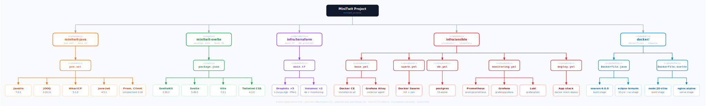
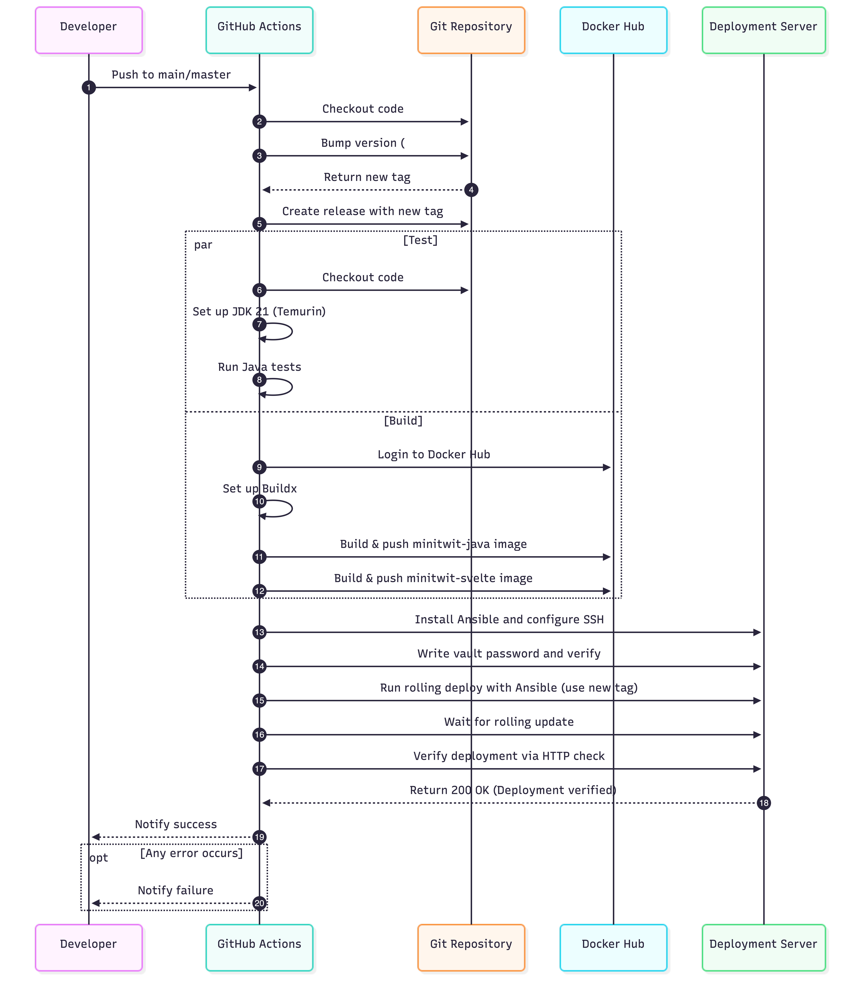

 
<!--
Your final report should be maximum 2500 words long, approx 5-6. So, try to be brief and concise, but be sure to include all necessary information listed below. Note, images do not count as words.

Make sure that you link all artifacts that you consider constitutional to your projects together with short descriptions of the linked artifacts from your reports, i.e., link all necessary repositories, issue trackers, monitoring/logging systems, etc.

Since this is a group project and the report is written by a group make sure to indicate for each section the respective author(s).

Build:  ./build-report.sh
-->
 
# Systems Perspective

A description and illustration of the:

## Design and architecture of your ITU-MiniTwit systems.

Minitwit is a Twitter clone built with a Svelte frontend, a Java (Javalin) REST backend, and a PostgreSQL database. All the involved applications are containerized with Docker and deployed on DigitalOcean infrastructure using Docker Swarm for orchestration. Infrastructure provisioning is handled by OpenTofu (opensource fork of TerraForm) and Ansible, and the monitoring stack consists of Prometheus, Grafana, Loki and Grafana Alloy.

### Infrastructure Architecture


The production system runs across five DigitalOcean droplets as illustrated in the above figure. Three manager-worker swarm nodes form the application cluster, one dedicated droplet hosts the PostgreSQL database, and one dedicated droplet hosts the monitoring stack. Both the database and monitoring droplets have a DigitalOcean block storage volume attached, ensuring data persists across droplet recreations.

A DigitalOcean load balancer sits in front of the three swarm nodes, handling SSL termination via a Let's Encrypt certificate and distributing incoming traffic across the swarm. Each swarm node runs nginx as a reverse proxy, routing requests to the appropriate container based on the URL path — /api, /web, /swagger and /openapi route to the Java backend on port 7070, all other traffic goes to the Svelte frontend on port 80, and /grafana proxies across the private network to Grafana on the monitoring droplet. All cross-droplet communication outside the Swarm overlay network uses DigitalOcean's private network, such as connections from the swarm nodes to the database and monitoring droplets.

Docker Swarm manages container orchestration across the three nodes, running three replicas each of nginx, the Java backend and the Svelte frontend. The routing mesh ensures any node can handle any request regardless of which node the container is actually running on.

### Monitoring Architecture


Grafana Alloy runs on all the droplets, collecting logs of all the containers on each droplet and shipping them to Loki on the monitoring droplet. Prometheus scrapes metrics from the Java backend (/metrics) and node exporter on each node every 15 seconds. Grafana provides a unified dashboard querying both Prometheus and Loki. Node exporter exposes system-level metrics about the host machine, like CPU usage, memory, disk I/O and network traffic that prometheus can scrape and pass to Grafana for visualization.

### Application Architecture


The backend follows a three-layer architecture as illustrated in the above diagram. The API layer is split into two distinct entry points:

- the Web API (/web/*) serving the Svelte frontend with JWT-based authentication
- the Simulator API (/api/*) serving the course simulator with HTTP Basic Auth

Controllers in each entry point delegate to a shared business layer consisting of four services, Auth, User, Message and Timeline, which use repositories to access the database. All database access goes through jOOQ for type-safe SQL queries, backed by a HikariCP connection pool.

We applied this architecture because it enforces separation of concerns and encourages adherence to the single responsibility principle, as controllers handle only HTTP routing, services contain only business logic, and repositories handle only data access. This allowed us to use the same business logic for both the simulator and the Web API without duplicating code.

The separation also made the code more maintainable. Migrating to an ORM was straightforward, as all SQL code was already isolated within the repository layer

### Infrastructure as code

The entire infrastructure is provisioned through code. OpenTofu provisions the DigitalOcean droplets and volumes, while Ansible handles the configuration of the VMs created by OpenTofu. Ansible executes five playbooks in sequence: base setup, Swarm initialization, database configuration, monitoring setup and application deployment. A single provision.sh script runs the full provisioning sequence from scratch. Both tools are designed to be idempotent, meaning the scripts can safely be rerun if anything fails during the process.

-----------

- All dependencies of your ITU-MiniTwit systems on all levels of abstraction and development stages. That is, list and briefly describe all technologies and tools you applied and depend on.
- Describe the current state of your systems, for example using results of static analysis and quality assessments.

## Technology & System choice (Magnus tries to write something that may or may not make sense)

Our system runs across five servers:

- 3 **Swarm nodes** - Two of these runs both backend, frontend and nginx while one node only has nginx on it. This was done as an extra load balancer within the swarm itself making it the entry point for all trafic entering a node
- 1 **Database server** - Runs PostgreSQL with a dedicated volume from DigitalOcean
- 1 **Monitoring server** - Collects each of the docker containers' logs, as well as metrics via prometheus and  which then is viewable at the Grafana dashboard.

Java was chosen as the backend language due to the team's prior familiarity with it. For the web framework we chose Javalin, a lightweight alternative to larger frameworks like Spring Boot (this was a consideration in terms of the scope of the project in general **THOUGHTS AROUND THIS?**) — it requires far less configuration and setup, which suited the scope of having 5 nodes in total. **(feel free to change this if there are any one who disagrees)**

For container orchestration we used Docker Swarm rather than Kubernetes. Swarm is simpler to operate and sufficient for the scale of this project. The group did also consider Kubernetes but this was scraped due to complexity **(OR WHAT WOULD BE SMART TO WRITE?)**. For cloud hosting we chose DigitalOcean, as the team had access to credits through GitHub Education.

In the early stages of the course, virtual machines were provisioned using Vagrant with a DigitalOcean provider and configured via a provision.sh script. In the latter half of the course, the group migrated over to OpenTofu (*an open-source version of Terraform*) and Ansible for configuration management due to Ansible's promise of idempotency (meaning applying the same operation several times does not affect the system) ( <-- **Arrrgh! I want a better sentence or something!**). The reason for this change to Ansible was that we were able to use Ansible's Vault for storing environment variable instead of having a `.env` file which had to manually edited on each computer as to not accidentally publish keys or other confidential information.

### Dependencies

The diagram below shows the dependencies across the project such as build tools, libraries and images for docker containers.



`Minitwit-java` uses the `pom.xml` file for managing its dependencies whereas the Svelte frontend uses npm (node package manager) to manage its dependencies. The infrastructure of the VMs is being handled by Terraform which creates the necessary droplets and volumes (for data storage) through the `main.tf` script - Ansible is then provisioning each machine with `base.yml` - installing all the shared dependencies across nodes - and then, depending on the VM, provisions the VM with either `swarm.yml`, `db.yml`, `monitoring.yml`. Then the final *playbook* `deploy.yml` deploys the docker swarm/stack.

By using OpenTofu in conjunction with Ansible, we have been able to more easily provision each machine an ensure idempotency across the nodes. This also has provided us with an more streamlined approach to initialising new machines.


\newpage

# Process Perspective

This perspective should clarify how code or other artifacts come from idea into the running system and everything that happens on the way.

In particular, the following descriptions should be included:

- A complete description and illustration of stages and tools included in the CI/CD pipelines, including deployment and release of your systems.
- What do you log in your systems and how do you aggregate logs?
- How do you handle availability and scaling in your systems?

## CI/CD Pipline

### Github Workflows | CI/CD as code



## Monitoring Architecture and Data Flow

Our monitoring setup consists of three components:

- Application - Javalin app - produces metrics
- Prometheus -collects and stores metrics over time
- Grafana - visualizes metrics

### How metrics are stored (labels + time)

Each metric is not just one value.
It is split into multiple counters based on labels, and each of those is tracked over time.

#### Labels (different counters)

When we define:

```
.labelNames("method", "path", "status")
```

we are creating a separate counter for each combination of method, path and status so at one point in time, the application exposes:

```
minitwit_http_requests_total{method="GET",  path="/api/msgs",  status="200"} = 10
minitwit_http_requests_total{method="POST", path="/api/msgs",  status="200"} = 5
minitwit_http_requests_total{method="GET",  path="/api/fllws", status="404"} = 2
```

Each of these is its own counter. Prometheus calls /metrics repeatedly every 15 seconds and stores the values as such:

```
(GET, /api/msgs, 200)
00:00 -> 5
00:15 -> 7
00:30 -> 10

(POST, /api/msgs, 200)
00:00 -> 2
00:15 -> 3
00:30 -> 5
```

For every label combination, Prometheus stores a timeline of values. Many counters (labels). Each with its own history - hence each unique set of labels creates its own time series that Prometheus tracks over time.

#### How Queries Work

Prometheus stores all collected snapshots as a time series `[100, 120, 150, ...]`
Historical data is created by Prometheus repeatedly sampling the application.
Functions like: `rate(minitwit_http_requests_total[5m])` work by comparing stored values over time: `(150 - 120) / time`

This allows Prometheus to compute:

- request rate (requests per second)
- trends over time
- error rates etc

#### Role of Grafana

Grafana does not store or compute metrics it queries Prometheus then visualizes the returned time series data. The system works because of the following separation:

- Application - only knows the current value
- Prometheus - builds history by sampling repeatedly

Without Prometheus, there is no history
Without history, there are no rates or trends

### Dashboard Structure Basic Model

Building these dashboards has been critical for understanding how metrics are collected, stored, and interpreted in Grafana. Debugging incorrect metrics, understanding why counters reset (application restarts) and understanding how rate-based queries work.

Grafana is deployed on a separate droplet. This ensures that monitoring remains available even if the application becomes unresponsive, allowing us to detect both errors and silence in the system. We divide our dashboards into two categories.

#### Business dashboards

focus on how the platform is being used, identify trends in user activity and usage patterns, answering questions such as how endpoints are used, where users interact most, and where issues such as errors or timeouts occur.

#### Operational dashboards

monitors system-level metrics such as CPU usage, memory usage, disk usage, and disk I/O.

From an operational perspective, both errors and absence of data are important signals. An error code indicates failure, but a complete lack of incoming data can also indicate that the system is down.

### Logging Architecture and Data Flow

Our logging setup consists of three components:

- Application - Javalin app - produces logs
- Loki - collects and stores logs over time
- Grafana - visualizes logs

#### How logs are stored

Logs are not numeric values like metrics but textual events describing what happens in the system. Each log entry represents a specific event such as an error, request, or system message.
The application produces logs using a logger, for example:

```
log.error(...)
log.info(...)
```

At one point in time, the application may produce logs such as:

```
User login failed for user X
Request to /api/msgs returned 500
User Y followed user Z
```

Each of these is an individual log entry.
Loki collects these logs and stores them over time, similar to how Prometheus stores metrics, but without aggregating them into numeric values.

#### How logs are queried

Logs are stored as a timeline of events rather than a sequence of numbers.
Instead of computing rates or averages, logs are queried to:

- find specific events
- trace errors
- understand what happened at a given point in time

#### Loki's Role of Grafana

Grafana queries Loki and visualizes logs in a searchable format.
The system works because of the following separation:

- Application - produces log messages
- Loki - builds history by storing logs over time

Without Loki, there is no log history
Without log history, debugging and tracing issues becomes significantly harder

#### Basic Model summary

- Application = produces events (log messages)
- Loki = stores events over time
- Grafana = visualization and search


## Security

### Git Break In {#git-break-in}

**Risk level:** High (Impact: High, Probability: Medium.)

**Description:** If a team member's GitHub account is compromised, an attacker can grant themselves admin rights, push malicious code, and approve pull requests.

**Mitigation & Scenarios:** We enforce two-factor authentication and restrict admin privileges through RBAC, including a super-admin role.

### Java Dependencies {#java-dependencies}

**Risk level:** High (Impact: High, Probability: Medium.)

**Description:** Our system relies heavily on the Javalin framework and third-party libraries for all endpoints and HTTP(S) traffic.

**Mitigation & Scenarios:** We keep all dependencies updated to stable versions and monitor for known vulnerabilities.

### Java Database {#java-database}

**Risk level:** Medium (Impact: Medium, Probability: Medium.)

**Description:** We use JOOQ ORM and the PostgreSQL JDBC driver to interact with the database, which can introduce SQL-related risks.

**Mitigation & Scenarios:** We avoid raw SQL concatenation and ensure all database-related libraries are kept up to date.

### Digital Ocean {#digital-ocean}

**Risk level:** High (Impact: High, Probability: Medium.)

**Description:** Deletion of droplets or volumes can lead to downtime and data loss.

**Mitigation & Scenarios:** We perform daily backups and use Terraform to recreate infrastructure if resources are deleted.

### Node Modules (NPM) {#node-modules}

**Risk level:** Medium (Impact: Medium, Probability: Medium.)

**Description:** Third-party Node dependencies may introduce vulnerabilities or be compromised through supply chain attacks.

**Mitigation & Scenarios:** We audit dependencies (e.g. npm audit), keep packages updated, and review new additions carefully.

### UFW {#ufw}

**Risk level:** High (Impact: High, Probability: Medium.)

**Description:** If the firewall is misconfigured, unnecessary ports may be exposed. Docker port mappings can bypass firewall rules.

**Mitigation & Scenarios:** We deny incoming traffic by default, allow only required ports, restrict SSH access, and ensure Docker does not bypass UFW.


\newpage

# Reflection Perspective

Describe the biggest issues, how you solved them, and which are major lessons learned with regards to:

- evolution and refactoring
- operation, and
- maintenance

of your ITU-MiniTwit systems. Link back to respective commit messages, issues, tickets, etc. to illustrate these.

Also reflect and describe what was the "DevOps" style of your work. For example, what did you do differently to previous development projects and how did it work?


\newpage

# Use of Generative AI

<!--
ITU's guidelines on generative AI apply to this report. For projects like this one, GenAI is allowed as long as we 
(1) state which tools have been used, 
(2) describe how they have been used, and 
(3) respect GDPR and copyright — meaning no personal data and no copyrighted material (textbooks, articles, proprietary source code) should be uploaded to a chatbot without consent. The full guidelines are available on [ITU Student](https://itustudent.itu.dk/Study-Administration/Generative-AI).
-->

## Tools used

Throughout the project we used **Claude** (Anthropic), **ChatGPT** (OpenAI), **Gemini** (Google), and **GitHub Copilot** as coding assistants.

## How they were used

We've been using AI as a sparring partner throughout the whole project. It was something we could discuss our ideas with and ask questions like "why does this not work?". We also used it as a coding assistant, and we had a setup on GitHub with Copilot that helped us clean up the code and catch bad patterns or potential bugs before they made it in.

All generated code was read, tested, and adapted before being committed.

## Reflection

We all come from the Software Design programme and took this course in our second semester, so the learning curve was a bit steep. Despite some prior production experience in the group, we leaned on AI tools to explain the system, walk us through the components we had to implement, and act as a coding assistant.

Looking back, the tools clearly accelerated how quickly we could implement and understand things, but the trade-off was that we sometimes skipped the exercises and went straight into implementing on the project. If we did something similar again, we would probably spend more time working through the exercises first and only then move on to the project implementation. Because AI output always looks like it has the answer, we also over-relied on it at times. Towards the end of the project we got better at discussing problems in the group and putting them on the whiteboard rather than turning to an AI first, and that approach really helped us land a good setup for our Docker Swarm migration.