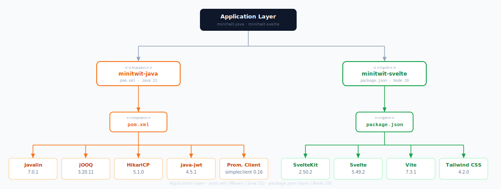
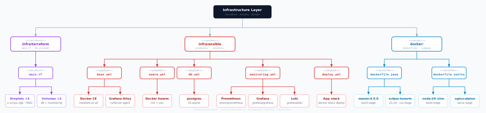
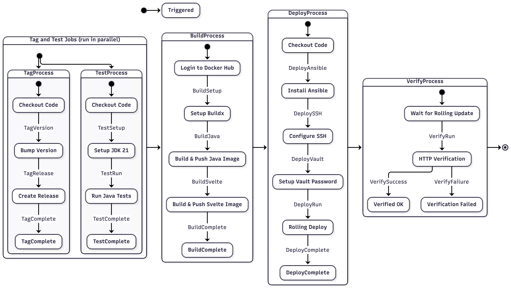
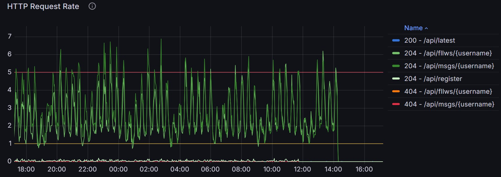
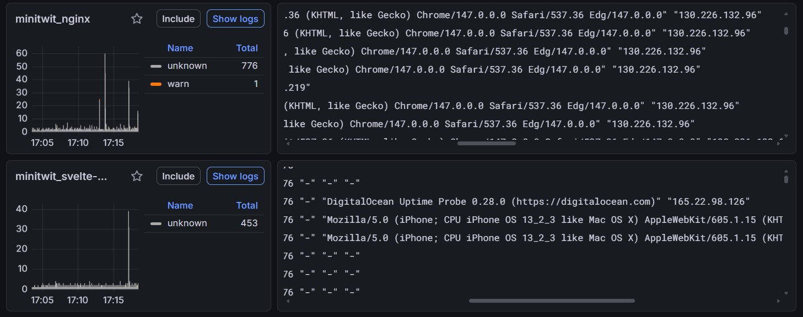
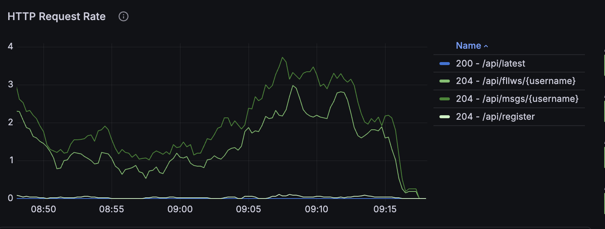

 
<!--
Your final report should be maximum 2500 words long, approx 5-6. So, try to be brief and concise, but be sure to include all necessary information listed below. Note, images do not count as words.

Make sure that you link all artifacts that you consider constitutional to your projects together with short descriptions of the linked artifacts from your reports, i.e., link all necessary repositories, issue trackers, monitoring/logging systems, etc.

Since this is a group project and the report is written by a group make sure to indicate for each section the respective author(s).

Build:  ./build-report.sh
-->
 
# Systems Perspective

## Design and Architecture of Minitwit

Minitwit is a Twitter clone built with a Svelte frontend, a Java (Javalin) REST backend, and a PostgreSQL database. All the involved applications are containerized with Docker and deployed on DigitalOcean infrastructure using Docker Swarm for orchestration. Infrastructure provisioning is handled by OpenTofu (opensource fork of TerraForm) and Ansible, and the monitoring stack consists of Prometheus, Grafana, Loki and Grafana Alloy.

The architecture is divided into three interconnected layers: Infrastructure, Monitoring, and Application, all provisioned and managed entirely via Infrastructure as Code.

### Infrastructure Architecture

Our system runs across five DigitalOcean droplets as illustrated in the above figure. Three manager-worker swarm nodes form the application cluster, one dedicated droplet hosts the PostgreSQL database, and one dedicated droplet hosts the monitoring stack. 

Docker Swarm manages container orchestration across the three nodes, running three replicas each of nginx, the Java backend and the Svelte frontend. The routing mesh ensures any node can handle any request regardless of which node the container is actually running on.

A DigitalOcean load balancer sits in front of the three swarm nodes, handling SSL termination via a Let's Encrypt certificate and distributing incoming traffic across the swarm. Each swarm node runs nginx as a reverse proxy, routing requests to the appropriate container based on the URL path — /api, /web, /swagger and /openapi route to the Java backend on port 7070, all other traffic goes to the Svelte frontend on port 80, and /grafana proxies across the private network to Grafana on the monitoring droplet. All cross-droplet communication outside the Swarm overlay network uses DigitalOcean's private network, such as connections from the swarm nodes to the database and monitoring droplets. Both the database and monitoring droplets have a DigitalOcean block storage volume attached, ensuring data persists across droplet recreations.

To monitor the health and performance of our infrastructure in production, we deployed a dedicated monitoring stack described below.

### Monitoring Architecture

Grafana Alloy runs on all the droplets, collecting logs from containers running on each droplet and shipping them to Loki on the monitoring droplet. Prometheus scrapes metrics from the Java backend (/metrics) and node exporter on each node every 15 seconds. Grafana provides a unified dashboard querying both Prometheus and Loki. Node exporter exposes system-level metrics about the host machine, like CPU usage, memory, disk I/O and network traffic that Prometheus can scrape and pass to Grafana for visualization. Together, these tools provide a complete overview of the system at both the application and infrastructure levels.

With the infrastructure and monitoring in place, the application itself is structured as follows.

### Application Architecture

The backend follows a three-layer architecture as illustrated in the above diagram. The API layer is split into two distinct entry points:

- the Web API (/web/*) serving the Svelte frontend with JWT-based authentication
- the Simulator API (/api/*) serving the course simulator with HTTP Basic Auth

Controllers handle incoming requests and pass the work to the services which are divided up into four different domains: authentication, users, messages and timeline. These services contain the core business logic of the Minitwit application. To read and write data, the services rely on three repositories — user, message, and follower — each responsible for interacting with its corresponding table in the database.

We applied this architecture because it enforces separation of concerns while adhering to the single responsibility principle, as controllers handle only HTTP routing, services contain only business logic, and repositories handle only data access. This allowed us to use the same business logic for both the simulator and the Web API without duplicating code. The separation also made the code more maintainable. Migrating to an ORM was straightforward, as all SQL code was already isolated within the repository layer

To make deployment and maintenance of this architecture reproducible, the entire infrastructure is managed through code.

### Infrastructure as code

OpenTofu provisions the DigitalOcean droplets and volumes, while Ansible handles the configuration of the VMs created by OpenTofu. Ansible executes five playbooks in sequence: base setup, Swarm initialization, database configuration, monitoring setup and application deployment. A single provision.sh script runs the full provisioning sequence from scratch. Both tools are designed to be idempotent, meaning the scripts can safely be rerun if anything fails during the process.

## Technology & System choice 

Java was chosen as the backend language due to the team's prior familiarity with it. For the web framework we chose Javalin, a lightweight alternative to the popular framework Spring Boot, that requires far less configuration, which suited the scope of this project. As Software Design students, we wanted to keep the programming complexity in check so we had room to focus on and properly adopt the right DevOps practices.

For container orchestration we used Docker Swarm rather than Kubernetes. Swarm is simpler to operate and more than sufficient for the scale of this project. We considered Kubernetes but scrapped it due to complexity and because the course steered us towards Docker Swarm. For cloud hosting, we chose DigitalOcean due to available credits through GitHub Education and its recommendation within the course, which allowed us to focus on the application rather than managing physical infrastructure.

Infrastructure provisioning evolved over the course of the project. Early on, virtual machines were provisioned using Vagrant with a DigitalOcean provider and configured via a `provision.sh` script, but this became difficult to maintain as the script grew cluttered with conditionals in an attempt to make it idempotent. We therefore migrated to OpenTofu and Ansible in the latter half of the course. The declarative style of OpenTofu and Ansible gave us the idempotency that the shell script lacked, and made it possible to bring the entire system up or down with a single command. In addition, Ansible's Vault allowed us to store secrets securely without a manually shared `.env` file, which had troubled us before.

### Dependencies

The two diagrams below shows the dependencies across the project such as build tools, libraries and images for docker containers.

`Minitwit-java` uses the `pom.xml` file for managing its dependencies whereas the Svelte frontend uses npm (node package manager) to manage its dependencies. The infrastructure of the VMs is being handled by OpenTofu (TerraForm) which creates the necessary droplets and volumes (for data storage) through the `main.tf` script - Ansible is then provisioning each machine with `base.yml` - installing all the shared dependencies across nodes - and then, depending on the VM, provisions the VM with either `swarm.yml`, `db.yml`, `monitoring.yml`. Then the final *playbook* `deploy.yml` deploys the docker swarm/stack.

By using OpenTofu in conjunction with Ansible, we have been able to more easily provision each machine an ensure idempotency across the nodes. This also has provided us with an more streamlined approach to initialising new machines.

\newpage

# Process Perspective

## CI/CD Pipeline

### Github Workflows | CI/CD as code

GitHub Actions was chosen for its native integration with our existing GitHub repository, eliminating the need for a separate CI/CD service. While alternatives such as Jenkins or Forgejo offer self-hosted execution and faster feedback loops, the operational overhead of maintaining additional infrastructure outweighed the benefits at our scale. The pipeline implements continuous deployment: every push to main that touches application code is automatically version-tagged, tested, built, and deployed to production without manual intervention, as illustrated in the activity and sequence diagrams. Tests act as the deployment gate, meaning a failing test job would block the build and deploy stages from running. The test suite covers the core application flows (registration, authentication, timelines, and follow/unfollow behaviour) as well as the simulator API endpoints that were actively tested against during the course. A dry-run workflow on test/** branches allowed us to validate infrastructure changes safely before merging.

## Monitoring Architecture and Data Flow

Our monitoring setup consists of three components working in sequence: the Javalin backend exposes metrics at `/metrics`, Prometheus scrapes that endpoint every 15 seconds and stores the resulting time series, and Grafana queries Prometheus to visualize request rates, error rates, and trends over time. Each metric is tracked across method, path, and status code, meaning Prometheus maintains a separate time series for each unique combination, making it possible to monitor per-endpoint traffic and error rates independently.

For logging, Grafana Alloy runs on each droplet and ships container logs to Loki on the monitoring droplet. Grafana queries Loki alongside Prometheus, giving a unified view of metrics and logs on the same dashboard and making it possible to correlate a spike in error rates with the specific log entries that caused it.

We built three dashboards covering different layers of the system. The HTTP Requests dashboard tracked request rate, failure rate, response times, and total request counts per endpoint which became the most operationally useful, giving direct visibility into simulator traffic and API health. The JVM Resources dashboard monitored heap usage, thread states, garbage collection, and Hikari connection pool saturation and acquisition latency. The Minitwit Server Health dashboard used node exporter to track CPU, memory, disk usage, and disk I/O across the droplets. In combination with the built dashboards we made use of the Grafana Logs drilldown via Loki. After some label engineering, the log drilldown allowed us to inspect live log streams per container, namely nginx, the Java backend, Svelte, and the monitoring stack itself. A Postgres dashboard was set up to track total users, messages, and follows.

## Security

| Risk | Risk Level | Impact | Probability | Description | Mitigation |
|------|------------|--------|-------------|-------------|------------|
| Git Break In | High | High | Medium | If a team member's GitHub account is compromised, an attacker can grant themselves admin rights, push malicious code, and approve pull requests. | Enforce two-factor authentication and restrict admin privileges through RBAC, including a super-admin role. |
| Java Dependencies | High | High | Medium | The system relies heavily on the Javalin framework and third-party libraries for all endpoints and HTTP(S) traffic. | Keep all dependencies updated to stable versions and monitor for known vulnerabilities. |
| Java Database | Medium | Medium | Medium | JOOQ ORM and the PostgreSQL JDBC driver are used to interact with the database, which can introduce SQL-related risks. | Avoid raw SQL concatenation and ensure all database-related libraries are kept up to date. |
| Digital Ocean | High | High | Medium | Deletion of droplets or volumes can lead to downtime and data loss. | Perform daily backups and use Terraform to recreate infrastructure if resources are deleted. |
| Node Modules (NPM) | Medium | Medium | Medium | Third-party Node dependencies may introduce vulnerabilities or be compromised through supply chain attacks. | Audit dependencies (e.g. `npm audit`), keep packages updated, and review new additions carefully. |
| UFW | High | High | Medium | If the firewall is misconfigured, unnecessary ports may be exposed. Docker port mappings can bypass firewall rules. | Deny incoming traffic by default, allow only required ports, restrict SSH access, and ensure Docker does not bypass UFW. |

\newpage

# Reflection Perspective

Throughout the semester we adhered to the weekly schedule and encountered the issues covered in the lectures almost exactly as expected. As the complexity of the project grew, so too did the complexity of the problems we ran into. Identifying the problem was generally simpler than aligning on how to solve it. Our migration to Docker Swarm is a good example of this.

During this migration, we decided to copy the database manually to ensure all data was in place before pointing the load balancer at the new five-droplet architecture. This avoided the data loss we had experienced when migrating from SQLite to PostgreSQL (PR #39, `c67392d`). However, the restore command we used:
`docker exec -i <containername> pg_restore --clean -U <postgresuser> -d <databasename> < /tmp/backup.dump` 

copied not just the data but also the existing indexes and tables, circumventing `schema.sql` as the source of truth. The simulator_state table on the server differed from the one in `schema.sql`, which caused a bug as soon as the new system started handling API requests. Because of the monitoring infrastructure we had set up, the Grafana dashboards gave us the visibility needed to debug the issue quickly.

Corbijn saw the `latestID` bottom out and quickly fixed the database to give `state_key` a unique constraint, which resolved the issue.

A more profound and pervasive issue is visible throughout our commit history: the overhead of five developers sharing one codebase, one deployment target, and no standardized system for managing credentials or local environments. We tried devcontainers early on (`52f78a3`) but that didn't solve our needs. Magnus spent time organizing the `.env` file so that each of our public keys were stored on DigitalOcean (`ecc2934`, `6bb1f4b`) and that worked somewhat, but our keys were hardcoded for a bit in the beginning. A shared `.env.template` arrived six weeks in (`06cca45`), with further env file fixes still needed after that (`975ccbd`, `aaa719c`, `116b4c0`). Introducing Ansible (`961602a`) and OpenTofu (`92a333a`) made a big difference and storing secrets in the Vault was far easier to manage and reason about. The OpenTofu state file was managed by a single team member. Setting up a shared remote state backend was considered but deemed unnecessary given that the infrastructure was stable after the initial migration and rarely needed to be reprovisioned.

What this project did differently from previous development work was treat infrastructure, deployment, and operations as first-class engineering concerns rather than end-of-project chores. From week three we introduced the CI/CD pipeline (`de742b3`), infrastructure as code, version-controlled dashboards (`24aff3c`), and automated semantic versioning (`ea74933`). These paid dividends when issues arose because they shortened the distance between a problem occurring in production and a developer understanding why. The Grafana dashboard catching the `latestID` bug during migration is the clearest proof of that.

\newpage

# Use of Generative AI

<!--
ITU's guidelines on generative AI apply to this report. For projects like this one, GenAI is allowed as long as we 
(1) state which tools have been used, 
(2) describe how they have been used, and 
(3) respect GDPR and copyright — meaning no personal data and no copyrighted material (textbooks, articles, proprietary source code) should be uploaded to a chatbot without consent. The full guidelines are available on [ITU Student](https://itustudent.itu.dk/Study-Administration/Generative-AI).
-->

## Tools used

Throughout the project we used **Claude** (Anthropic), **ChatGPT** (OpenAI), **Gemini** (Google), and **GitHub Copilot** as coding assistants.

## How they were used

We used AI primarily as a sparring partner, discussing ideas, debugging issues, and asking questions like 'why does this not work?'. GitHub Copilot was integrated directly into our workflow (Pull Requests) to catch bad patterns and potential bugs during code review. It was particularly useful during the planning phase, where it helped us identify potential architectural problems early and evaluate technology choices before committing to them.

All generated code was read, tested, and adapted before being committed.

## Reflection

All of our group members come from the Software Design programme and took this course in our second semester, so the learning curve was a bit steep. Despite some prior work experience in the group, we leaned on AI tools to explain the system, walk us through the components we had to implement, and act as a coding assistant.

Looking back, the tools clearly accelerated how quickly we could implement features and understand unfamiliar technology, but the trade-off was that we sometimes skipped the exercises and went straight into working on the project. If we were to do this again, we would probably spend more time working through the exercises first and only then move on to the project implementation. Because AI output always looks like it has the answer, we also over-relied on it at times. Towards the end of the project we got better at discussing problems in the group and putting them on the whiteboard rather than turning to AI first, and that approach really helped us land a good setup for our Docker Swarm migration.